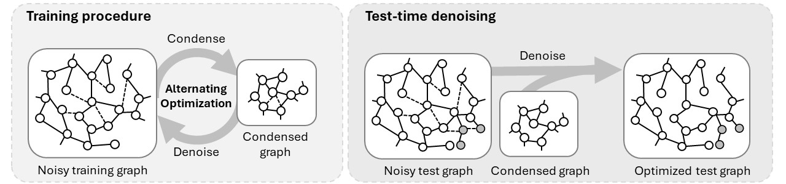

# RobGC
## Introduction

This repository is the implementation of paper: RobGC: Towards Robust Graph Condensation. 

\



## Data
The code is based on the graph condnesation method [GGond](https://github.com/ChandlerBang/GCond/tree/main). 
For cora, citeseer and pubmed, the code will directly download them; so no extra script is needed.
For Ogbn-arxiv, we use the datasets provided by [GraphSAINT](https://github.com/GraphSAINT/GraphSAINT). 
They are available on [Google Drive link](https://drive.google.com/open?id=1zycmmDES39zVlbVCYs88JTJ1Wm5FbfLz) (alternatively, [BaiduYun link (code: f1ao)](https://pan.baidu.com/s/1SOb0SiSAXavwAcNqkttwcg)). Rename the folder to `./data` at the root directory. Note that the links are provided by GraphSAINT team. 

## Model training

To generate the noisy data and condense the graph:

```bash
$ bash ./scr/attack.sh
$ bash ./scr/run.sh
```


## Aknowledgements
We express our gratitude for the contributions of [GGond](https://github.com/ChandlerBang/GCond/tree/main) and [DeepRobust](https://github.com/DSE-MSU/DeepRobust) in their remarkable work.
